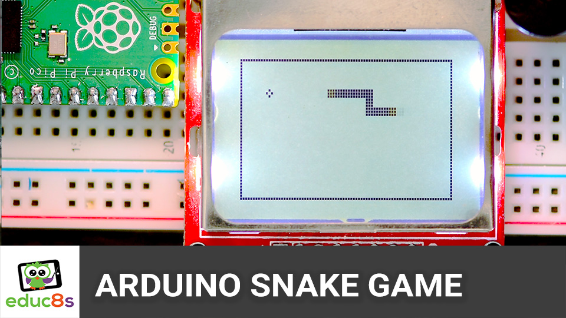

# Arduino Snake Game Nokia 5110 Clone

This is a Snake game Clone on a Raspberry Pi Pico board and a Nokia 5110 display.
# Video Tutorial

  

🎥 <a href="https://youtu.be/PiKJgczhLNM">Video Tutorial on YouTube</a>

 
 

| 📺 <a href="https://www.youtube.com/educ8s">YouTube</a>
| 🌍 <a href="http://www.educ8s.tv">Website</a> |  

# Parts Needed
🛒 Display: http://educ8s.tv/part/NOKIA5110

🛒 Raspberry Pi Pico: http://educ8s.tv/part/RaspberryPiPico

🛒 Joystick Module: http://educ8s.tv/part/joystick

🛒 Breadboard: http://educ8s.tv/part/LargeBreadboard

🛒 Buzzer: http://educ8s.tv/part/Buzzer

🛒 Wires: http://educ8s.tv/part/Wires

🛒 Jumper Wires: http://educ8s.tv/part/JumperWires

💖 Full disclosure: All of the links above are affiliate links. I get a small percentage of each sale they generate. Thank you for your support!
